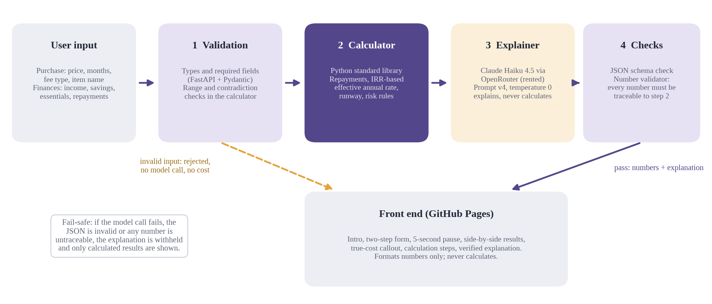
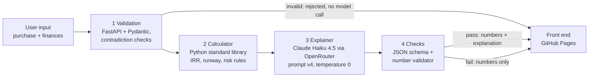

# PauseBeforeBuy · Product documentation

**Live product:** https://judylou0117-stack.github.io/PauseBeforeBuy/ · **API:** https://pausebeforebuy.onrender.com · **Demo video:** https://youtu.be/YGzhOuEw7qE · **Report:** [PDF](report/PauseBeforeBuy_Final_Report_YaoLu.pdf)

## Persona

**Who:** students and young working adults in Singapore who buy online and are offered buy-now-pay-later (BNPL) or credit-card instalments. In our study, 6 of 8 classmates had used them.

**When:** at the moment of an impulse purchase, usually on a phone, when the checkout shows a small monthly number such as “SGD 536 a month, only 0.6% per instalment”.

**Pain:** the monthly number hides the total cost and the true yearly rate (0.6% per instalment on the original price is 13.84% a year, not 7.2%), and BNPL plans can stack across apps without anyone adding them up. Before using the tool, only 2 of 8 participants could estimate the true cost.

**Need:** a quick, neutral comparison of paying in full, paying in instalments and waiting to save, without being told what to buy and without linking a bank account.

## Input

| Group | Fields |
|---|---|
| Purchase | item name (optional, max 40 characters), price, number of instalments (1–60), fee type: 0% / fee per instalment (% per month) / annual interest rate (% per year), optional one-time fee |
| Finances | monthly take-home income, cash savings, monthly essential spending, existing monthly repayments |
| Settings (optional) | emergency fund target in months (default 3), repayment warning line (default 35%) |
| Language | English or Chinese |

Financial details are saved only in the user’s browser (localStorage). For each simulation they are sent to the back end to calculate the result and, for the explanation, through OpenRouter to the model. The back end stores nothing; retention by OpenRouter or the model provider follows their own policies and cannot be verified from this code. Nothing is linked to a bank or payment app.

## Output

For each of the three options (pay in full, pay in instalments, wait and save):

- total paid, extra cost, monthly payment (and the fee part of it) or months needed to save
- savings after buying, money left each month, share of income spent on repayments
- emergency runway: how many months of essential spending the savings would cover
- risk level (Low / Medium / High, shown as neutral dots) and risk flags
- every calculation step (formula, numbers, result), expandable

Plus: the offer’s headline fee shown next to the **true effective annual rate**; a plain-language explanation in English or Chinese, shown **only if it passes all checks**; reflective “questions to ask yourself”; and a short “what else could this money do?” card.

## Architecture

| Layer | Built or rented | Where |
|---|---|---|
| Input validation | Built | `backend/app/main.py`, `backend/app/calculator.py` |
| Calculator and risk rules (all numbers) | Built | `backend/app/calculator.py` |
| Explanation (language only) | Rented: Claude Haiku 4.5 via OpenRouter | `backend/app/explainer.py` |
| Prompt, schema check, number validator, fail-safe | Built | `backend/app/explainer.py`, `backend/app/service.py` |
| Front end | Built | `docs/index.html` |
| Hosting | Rented: GitHub Pages (front end), Render free tier (back end) | `render.yaml` |

Design rules: the model never calculates; the front end never calculates; any explanation with the wrong structure, or containing a number that cannot be traced to the calculator, is withheld. No agent and no RAG: the path is fixed, and the few authoritative thresholds are encoded as cited rules (see `data/README.md`).

## Metrics: targeted versus reached

| Metric | Target | Reached | Status |
|---|---|---|---|
| Comprehension: participants answering at least 4 of 5 core questions correctly | ≥ 70% | 50% (4 of 8); 5 of 8 when judged against each participant’s own inputs | Not met |
| L1 automated tests | all pass | 19 / 19 | Met |
| Ten-case set: deterministic checks | 10 / 10 | 10 / 10 | Met |
| Explanations passing the number validator | all | 8 / 8 | Met |
| Invalid inputs blocked before the model | all | 2 / 2 (no cost) | Met |
| Prompt-injection leaks | 0 | 0 | Met |
| Human (L2) review of explanations | all pass | 6 / 8 pass; 2 fail (T5 neutrality, E3 cost breakdown) | Not met |
| Cost per simulation | as low as possible | about USD 0.0047 | Measured |
| Latency with the model | not set | 7.7 s mean (mostly within the 5-second pause) | Measured |
| Knew the true yearly cost: before → after | not set | 2 of 8 → 4 of 8 | Measured |
| Experience (1–5) | not set | easy to understand 4.3, trusted the numbers 4.4, the pause made me rethink 4.8 | Measured |
| Neutrality: said the tool did not tell them what to choose | not set | 3 of 8 | Open issue |

Why the comprehension target was missed: inputs were not logged, but reverse-calculating the answers suggests that five participants entered the scenario incorrectly (answers consistent with a fee of 0.9 or 0.05 instead of 0.6, a price of 2,000, or missing repayments), one of them without following the scenario at all. With eight people, each participant moves the pass rate by 12.5 points. All three participants whose answers matched the correct scenario scored 5 of 5. Details: `study/README.md` and report Section 5.

## Known limitations

Small convenience sample; one scenario; no input confirmation step; the emergency-runway label was unclear to some users; prompt rules written for flat fees produced one misleading sentence about an amortised loan; the free Render server cold-starts.
